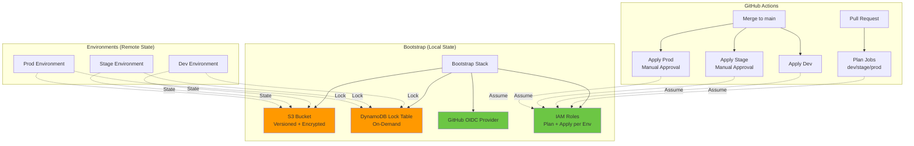

# AWS Terraform Remote State Starter

[](https://github.com/saranreddy/aws-terraform-remote-state-starter/actions/workflows/ci.yml)
[](https://opensource.org/licenses/MIT)
[](https://www.terraform.io/)

**Download-and-apply Terraform remote state starter for AWS teams.** S3 backend with DynamoDB locking, dev/stage/prod environments sharing modules, and GitHub Actions that plan on PR and apply on merge via OIDC—no long-lived credentials stored.

This shows how Terraform on AWS is run **by a team instead of from one laptop**: each engineer runs the same backend config, state is versioned and locked, and GitHub Actions authenticate through OIDC with scoped IAM roles instead of storing access keys.

## Who This Is For

**This starter is designed for:**

- **Small teams** moving off laptop-local `terraform.tfstate` and wanting shared, locked, versioned state
- **Startups** that need dev/stage/prod environments with reviewer-gated production deploys
- **Platform engineers** standardizing how teams start Terraform repositories
- **Teams** replacing long-lived AWS access keys in CI with OIDC credentials
- **Solo developers** who want a safe, reproducible setup that will scale when teammates join

**Common scenarios where this pattern fits:**
- You're running Terraform from laptops and hit "state locked" errors or conflicting changes
- You store AWS keys in GitHub secrets and want to eliminate that security risk
- You need separate environments with different approval workflows
- You want CI to plan on every PR and apply on merge, but don't have existing Terraform automation

**When NOT to use this:**

- **You already use Terraform Cloud, HCP Terraform, Spacelift, or Atlantis** — those platforms provide state management, locking, and CI/CD out of the box
- **You need multi-account AWS** via Organizations/Control Tower — this is a **single-account pattern**. For multi-account, look at AWS Control Tower with Account Factory for Terraform, or patterns with cross-account roles
- **You're running throwaway experiments** or learning Terraform basics — local state is simpler
- **You have complex governance requirements** (audit logs, policy-as-code, drift detection) — evaluate Terraform Cloud or Spacelift for built-in governance
- **You're managing dozens of Terraform roots** — at that scale, you need workspace management and centralized policy beyond what a template provides

**Single-account scope:** This starter manages resources in one AWS account. If you run separate AWS accounts for dev/stage/prod, you'll need cross-account IAM roles or separate backend buckets per account.

## Why Remote State?

Running Terraform with local state from your laptop works for solo demos, but teams hit problems fast:

- **Who has the latest state?** Local `.tfstate` files diverge when multiple people apply changes
- **No locking**: Two engineers applying at the same time corrupt state
- **No history**: Mistakes lose the last known good state
- **CI/CD needs credentials**: Storing long-lived AWS keys in GitHub is a security risk

**Remote state solves this**: a shared S3 bucket holds a single source of truth with versioning and optional encryption. DynamoDB provides locking so only one apply runs at a time. GitHub Actions authenticate through OIDC (OpenID Connect) with temporary credentials scoped to your repository and branches—no static keys to rotate or leak.

## Architecture



**Components:**

- **Bootstrap stack**: Creates S3 bucket (versioned, encrypted, no public access), DynamoDB lock table (on-demand billing), GitHub OIDC provider, and IAM roles for GitHub Actions
- **Environments**: Dev, stage, and prod each have their own state key in S3 (`dev/terraform.tfstate`, etc.) but share the same backend bucket
- **Shared modules**: A simple workload module (S3 bucket + SSM parameter) demonstrates code reuse across environments
- **GitHub Actions**: Plan on every PR (read-only IAM role), apply dev automatically on merge to `main`, apply stage/prod through GitHub Environments with required reviewers
- **OIDC trust**: IAM roles trust only your specific repository and branch/environment, never `repo:*`

## Prerequisites

- **AWS Account** with permissions for S3, DynamoDB, IAM, OIDC provider, SSM
- **AWS CLI** configured with credentials (`aws configure`)
- **Terraform** >= 1.5 (tested with 1.5.7 for DynamoDB locking compatibility)
- **Bash** for scripts (macOS and Linux)
- **make** (optional but recommended for convenience)

**macOS users**: If Xcode license is not accepted, `make` commands may fail. You can run raw Terraform commands or scripts directly.

## Quick Start

### 1. Check Prerequisites

```bash
make doctor
```

This checks AWS CLI, Terraform, credentials, and region. If `make` is unavailable:

```bash
bash scripts/doctor.sh
```

### 2. Bootstrap the Backend

The bootstrap stack creates the S3 bucket, DynamoDB table, OIDC provider, and IAM roles. It uses **local state** (stored in `bootstrap/terraform.tfstate`) because the backend doesn't exist yet.

**Copy and customize the bootstrap config:**

```bash
cd bootstrap
cp terraform.tfvars.example terraform.tfvars
```

Edit `terraform.tfvars`:

```hcl
aws_region        = "us-east-1"
project_name      = "myproject"
github_owner      = "myorg"           # GitHub org or username
github_repo       = "myrepo"          # Repository name (not full URL)
state_bucket_name = "myproject-terraform-state-unique-12345"  # Must be globally unique!

# Optional
lock_table_name                    = "terraform-state-lock"
noncurrent_version_expiration_days = 90
create_oidc_provider               = true
environments                        = ["dev", "stage", "prod"]
```

**Apply the bootstrap:**

```bash
terraform init
terraform apply
```

**Save the outputs:**

```bash
terraform output
```

You'll need the `state_bucket_name` and `lock_table_name` for the next step.

Or with `make`:

```bash
make bootstrap
```

### 3. Configure Backend for Environments

After bootstrap succeeds, generate backend configs from the outputs:

```bash
make backend-configs
```

This creates `backend-<env>.hcl` files in each environment directory with the correct bucket name, region, and lock table from bootstrap outputs.

**Or manually** edit each environment's backend config:

```bash
# Edit environments/dev/backend-dev.hcl
bucket         = "myproject-terraform-state-unique-12345"  # From bootstrap output
key            = "dev/terraform.tfstate"
region         = "us-east-1"
dynamodb_table = "terraform-state-lock"
encrypt        = true
```

The stage and prod configs are similar, with only the `key` changing to `stage/terraform.tfstate` and `prod/terraform.tfstate`.

### 4. Initialize and Apply Dev Environment

**Copy and customize dev config:**

```bash
cd environments/dev
cp terraform.tfvars.example terraform.tfvars
```

Edit `terraform.tfvars`:

```hcl
aws_region    = "us-east-1"
project_name  = "myproject"
environment   = "dev"
bucket_suffix = "unique-12345"  # Must be globally unique!
```

**Initialize with remote backend:**

```bash
terraform init -backend-config=backend-dev.hcl
```

This migrates to the remote S3 backend. Terraform will prompt to copy any local state; answer `yes` if you had local state (you shouldn't for a fresh setup).

**Apply dev infrastructure:**

```bash
terraform apply
```

Or with `make`:

```bash
make init-dev
make apply-dev
```

### 5. Verify with Smoke Test

```bash
cd ../..  # Back to repo root
make smoke
```

The smoke test checks:
- S3 state bucket exists and is accessible
- DynamoDB lock table exists
- Deployed environment resources exist (S3 bucket, SSM parameter)

### 6. Wire Up GitHub Actions (Optional)

To enable CI/CD with OIDC:

1. **Get the IAM role ARNs** from bootstrap outputs:

   ```bash
   cd bootstrap
   terraform output github_plan_role_arn
   terraform output github_apply_role_arns
   ```

2. **Add repository secrets** in GitHub Settings → Secrets and variables → Actions:

   - `AWS_REGION`: Your AWS region (e.g., `us-east-1`)
   - `GITHUB_PLAN_ROLE_ARN`: The plan role ARN (used for PRs)
   - `GITHUB_APPLY_DEV_ROLE_ARN`: The dev apply role ARN (used for merges to `main`)

3. **(Optional) Create GitHub Environments** for stage and prod:

   - Go to Settings → Environments
   - Create `stage` and `prod` environments
   - Add required reviewers for each
   - Add secrets `GITHUB_APPLY_STAGE_ROLE_ARN` and `GITHUB_APPLY_PROD_ROLE_ARN`

4. **Push a change** and open a PR. GitHub Actions will run `terraform plan` for all environments and post the plan as a comment.

5. **Merge to main**. GitHub Actions will apply dev automatically. Stage and prod require manual approval through GitHub Environments.

**Without AWS credentials configured**, the CI will skip AWS-touching jobs with a clear message, so the workflow stays green on fresh template repositories.

## Project Structure

```
.
├── README.md
├── LICENSE
├── CHANGELOG.md
├── Makefile
├── .gitignore
├── bootstrap/                      # Bootstrap stack (local state)
│   ├── versions.tf
│   ├── variables.tf
│   ├── main.tf
│   ├── s3.tf                       # S3 state bucket
│   ├── dynamodb.tf                 # DynamoDB lock table
│   ├── oidc.tf                     # GitHub OIDC provider
│   ├── iam.tf                      # IAM roles for GitHub Actions
│   ├── outputs.tf
│   └── terraform.tfvars.example
├── environments/
│   ├── dev/                        # Dev environment (remote state)
│   │   ├── versions.tf
│   │   ├── variables.tf
│   │   ├── main.tf
│   │   ├── outputs.tf
│   │   ├── backend-dev.hcl         # Backend config for dev
│   │   └── terraform.tfvars.example
│   ├── stage/                      # Stage environment (remote state)
│   │   ├── ...
│   │   └── backend-stage.hcl
│   └── prod/                       # Prod environment (remote state)
│       ├── ...
│       └── backend-prod.hcl
├── modules/
│   └── simple-workload/            # Example shared module
│       ├── variables.tf
│       ├── main.tf                 # S3 bucket + SSM parameter
│       └── outputs.tf
├── scripts/
│   ├── doctor.sh                   # Prerequisites check
│   ├── smoke_test.sh               # End-to-end validation
│   └── empty_bucket_versions.sh    # Cleanup before destroy
└── .github/
    └── workflows/
        └── ci.yml                  # GitHub Actions CI/CD
```

## Makefile Targets

```bash
make help                # Show all targets
make doctor              # Check prerequisites
make bootstrap           # Deploy bootstrap stack
make init-dev            # Initialize dev with remote backend
make init-stage          # Initialize stage
make init-prod           # Initialize prod
make plan-dev            # Plan dev changes
make apply-dev           # Apply dev changes
make destroy-dev         # Destroy dev resources
make smoke               # Run smoke test
make destroy-bootstrap   # Destroy bootstrap (last step)
make clean               # Clean .terraform dirs
```

**Raw commands without `make`:**

```bash
# Bootstrap
cd bootstrap
terraform init
terraform apply

# Dev environment
cd environments/dev
terraform init -backend-config=backend-dev.hcl
terraform plan
terraform apply

# Smoke test
bash scripts/smoke_test.sh

# Destroy dev
cd environments/dev
terraform destroy

# Destroy bootstrap (after all envs)
cd bootstrap
bash ../scripts/empty_bucket_versions.sh  # Clean S3 versions first
terraform destroy
```

## OIDC and IAM Design

### Why OIDC?

GitHub Actions can authenticate to AWS using OIDC instead of storing long-lived access keys. OIDC issues short-lived tokens that GitHub presents to AWS. AWS verifies the token with GitHub's public JWKS endpoint and grants temporary credentials.

**Benefits:**
- No secrets to rotate or leak
- Credentials expire automatically
- IAM trust is scoped to specific repos, branches, and environments

### IAM Roles

**Plan role** (`github-plan`):
- **Can read** workload resources (S3 bucket properties, SSM parameters) for plan refresh
- **Can read** state from S3 bucket (all environments, read-only)
- **Can lock** state via DynamoDB (GetItem, PutItem, DeleteItem)
- **Cannot write** state, workload resources, or other AWS resources
- **Trust**: `pull_request` events and `ref:refs/heads/main`
- **Resource scope**: Workload buckets matching `<project>-*-workload-*`, SSM parameters under `/<project>/*`

**Why the plan role can see all environment state:** Terraform plan needs to read the state to detect drift, but it's read-only. It cannot modify state or resources.

**Apply roles per environment** (`github-apply-dev`, `github-apply-stage`, `github-apply-prod`):
- **Can create/destroy** S3 buckets matching `<project>-<env>-workload-*` (versioning, encryption, public access block, tags)
- **Can create/destroy** SSM parameters under `/<project>/<env>/*`
- **Can read/write** only its own environment's state key: `<env>/*` in the state bucket
- **Cannot read/write** other environments' state keys (explicit deny)
- **Cannot modify** the state bucket itself (versioning, encryption, policy, lifecycle) or delete it (explicit deny)
- **Cannot modify or delete** the DynamoDB lock table (explicit deny)
- **Can lock** state via DynamoDB with condition scoped to `<bucket>/<env>/*` lock IDs
- **Trust conditions**:
  - **Dev**: `repo:<owner>/<repo>:ref:refs/heads/main` (merges to main branch)
  - **Stage**: `repo:<owner>/<repo>:environment:stage` (GitHub Environment with required reviewers)
  - **Prod**: `repo:<owner>/<repo>:environment:prod` (GitHub Environment with required reviewers)

**What each apply role CANNOT do:**
- Access or modify other environments' resources (different bucket/SSM prefixes)
- Access or modify other environments' state (explicit deny on S3 state keys)
- Delete or reconfigure the state bucket or lock table (explicit deny)
- Access arbitrary S3 buckets or SSM parameters outside the scoped prefixes
- Pass IAM roles or assume other roles (no IAM permissions)

This scoping means:
- PR plan jobs can refresh state but not apply changes
- Dev apply only runs on merge to `main` and can only touch dev resources and state
- Stage and prod apply only run through GitHub Environments with manual approval
- A compromised dev role cannot delete prod's workload or overwrite prod's state

### Trust Scoping

The bootstrap stack **never** uses `repo:*` wildcards. Trust is always scoped to your specific repository and branch/environment. If you fork or template this repo, you **must** update `github_owner` and `github_repo` in `bootstrap/terraform.tfvars`, then re-apply bootstrap to create new IAM roles with the correct trust.

## Adding a New Environment

To add a new environment (e.g., `qa`):

1. **Copy an existing environment:**

   ```bash
   cp -r environments/dev environments/qa
   ```

2. **Update `qa/variables.tf`:**

   ```hcl
   variable "environment" {
     default = "qa"
   }
   ```

3. **Update `qa/terraform.tfvars.example`:**

   ```hcl
   environment = "qa"
   ```

4. **Create `qa/backend-qa.hcl`:**

   ```hcl
   bucket         = "myproject-terraform-state-unique-12345"
   key            = "qa/terraform.tfstate"
   region         = "us-east-1"
   dynamodb_table = "terraform-state-lock"
   encrypt        = true
   ```

5. **Add `qa` to bootstrap environments list:**

   In `bootstrap/terraform.tfvars`:

   ```hcl
   environments = ["dev", "stage", "prod", "qa"]
   ```

6. **Re-apply bootstrap** to create the IAM role for `qa`:

   ```bash
   cd bootstrap
   terraform apply
   ```

7. **Initialize and apply `qa`:**

   ```bash
   cd environments/qa
   terraform init -backend-config=backend-qa.hcl
   terraform apply
   ```

8. **Add CI job for `qa`** in `.github/workflows/ci.yml` (add `qa` to the `matrix.environment` list).

## Cost

This starter is designed to stay within pennies per month:

- **S3 bucket**: $0.023 per GB-month (first 50 TB), state files are typically < 1 MB = **< $0.01/month**
- **S3 requests**: $0.005 per 1,000 PUT, $0.0004 per 1,000 GET, minimal usage = **< $0.01/month**
- **DynamoDB on-demand**: $1.25 per million write requests, $0.25 per million reads, state locking is very low volume = **< $0.01/month**
- **S3 versioning storage**: Old versions are lifecycle-deleted after 90 days (configurable), negligible cost for demo
- **Example workload**: S3 bucket (storage at rest) + SSM parameter (no cost) = **< $0.01/month if empty**

**Estimated total for one environment with minimal usage: < $0.10/month**

**What actually bills:**
- S3 storage (state file versions)
- S3 requests (Terraform init, plan, apply)
- DynamoDB requests (locking during apply)

**What doesn't bill:**
- IAM roles and policies
- OIDC provider
- SSM parameters (no cost for Parameter Store standard parameters)

**Teardown**: Run `make destroy-dev && make destroy-stage && make destroy-prod && make destroy-bootstrap` to remove all resources and stop charges.

## Migrating from Local to Remote State

If you already have local state in an environment and want to migrate to remote:

1. **Ensure bootstrap is applied** and backend config is updated with the S3 bucket name.

2. **Run `terraform init` with backend config:**

   ```bash
   cd environments/dev
   terraform init -backend-config=backend-dev.hcl
   ```

3. **Terraform will detect local state** and ask:

   ```
   Do you want to copy existing state to the new backend?
   ```

   Answer `yes`. Terraform will upload your local state to S3.

4. **Verify the migration:**

   ```bash
   terraform state list
   ```

   You should see your resources. The local `terraform.tfstate` file is no longer used.

5. **(Optional) Back up local state** before migrating:

   ```bash
   cp terraform.tfstate terraform.tfstate.backup
   ```

**Why bootstrap stays local:**

Bootstrap cannot use remote state because it creates the backend. You could migrate bootstrap to its own remote backend after the initial apply, but it's not recommended: bootstrap is a one-time operation, and having local state makes it easier to destroy if needed.

## S3 Native Locking (Terraform >= 1.10)

Terraform 1.10+ introduces S3 native locking with `use_lockfile = true`, which eliminates the need for DynamoDB. If you're using Terraform >= 1.10, you can simplify the backend:

```hcl
backend "s3" {
  bucket         = "myproject-terraform-state-unique-12345"
  key            = "dev/terraform.tfstate"
  region         = "us-east-1"
  encrypt        = true
  use_lockfile   = true  # S3 native locking (TF >= 1.10)
}
```

**To use S3 native locking with this starter:**

1. Remove DynamoDB table creation from `bootstrap/dynamodb.tf`
2. Remove `dynamodb_table` from backend configs
3. Add `use_lockfile = true` to backend configs

**Why this starter uses DynamoDB:**

The owner's Mac runs Terraform 1.5.7, and S3 native locking is not available. DynamoDB locking is battle-tested and works with all Terraform versions >= 1.5.

## Troubleshooting

### Bootstrap fails with "BucketAlreadyExists"

S3 bucket names are globally unique. Change `state_bucket_name` in `bootstrap/terraform.tfvars` to something more unique (e.g., add a random suffix or your account ID).

### Bootstrap fails with "EntityAlreadyExists" for OIDC provider

Your AWS account already has a GitHub OIDC provider. Set `create_oidc_provider = false` in `bootstrap/terraform.tfvars` and re-apply.

### Terraform init fails with "Error loading state"

The backend config might be incorrect. Check:

- `bucket` name matches the bootstrap output
- `region` matches your AWS region
- You have AWS credentials configured (`aws sts get-caller-identity`)

### State lock timeout

Another apply is running, or a previous apply was interrupted. Check:

```bash
aws dynamodb scan --table-name terraform-state-lock --region us-east-1
```

If you see a stuck lock, force-unlock it:

```bash
terraform force-unlock <lock-id>
```

**Be very careful**: only force-unlock if you're certain no other apply is running. Concurrent applies can corrupt state.

### OIDC trust error: "Not authorized to perform sts:AssumeRoleWithWebIdentity"

The IAM role's trust policy doesn't match your repository or branch. Common causes:

- GitHub repo name mismatch: ensure `github_owner` and `github_repo` in `bootstrap/terraform.tfvars` exactly match your repository
- Branch mismatch: dev apply role trusts `ref:refs/heads/main`, stage/prod trust environments
- You forked or templated the repo but didn't update `github_owner`/`github_repo` and re-apply bootstrap

Fix: update `bootstrap/terraform.tfvars` and run `terraform apply` in the bootstrap directory.

### GitHub Actions plan job fails with "No such file or directory: tfplan.txt"

The plan output is not being captured. This is a known issue in the workflow. Remove the "Post Plan Comment" step or modify it to use `terraform show -no-color tfplan` instead of reading a file.

### Destroy fails with "BucketNotEmpty"

The S3 state bucket has versions that must be deleted first. Run:

```bash
bash scripts/empty_bucket_versions.sh
```

This will list all versions and ask for confirmation before deleting them. Then retry `terraform destroy`.

### CI jobs show "Skipping plan (No AWS Config)"

This is expected for fresh template repositories. The CI is designed to pass without AWS credentials. Once you set up the repository secrets (`AWS_REGION`, `GITHUB_PLAN_ROLE_ARN`, etc.), the CI will run against AWS.

## Contributing

This is a starter template. Fork it, customize it, and make it your own. Contributions welcome via issues and PRs.

## Author

**Saran Reddy**  
Platform Engineer (AWS, Terraform, Kafka)  
GitHub: [github.com/saranreddy](https://github.com/saranreddy)

## License

MIT License - see [LICENSE](LICENSE) for details.
